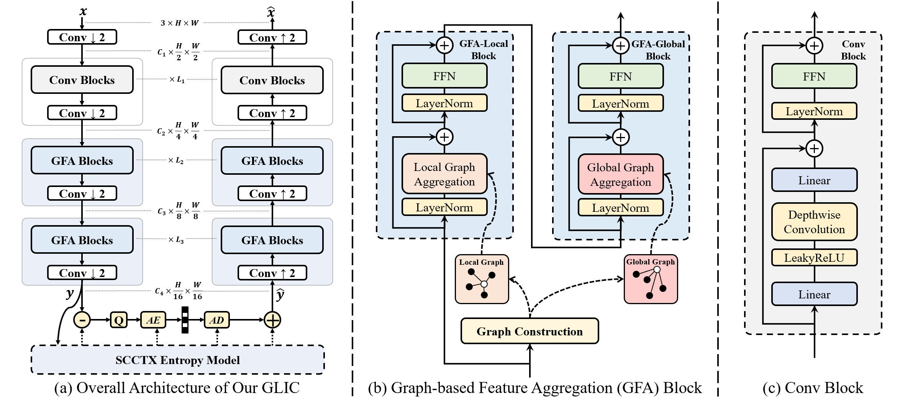

# CVPR2026-Adaptive Learned Image Compression with Graph Neural Networks


Our code and some of the checkpoints are released. In the meantime, if you are interested, please feel free to check out our previous paper and open-source repository: [Content-Aware Mamba for Learned Image Compression (ICLR 2026)](https://openreview.net/forum?id=WwDNiisZQm), [CMIC GitHub](https://github.com/UnoC-727/CMIC).


## Introduction

This repository present the offical [Pytorch](https://pytorch.org/) implementation of [Adaptive Learned Image Compression with Graph Neural Networks (CVPR2026)](https://arxiv.org/abs/2603.25316). 

**Abstract:**
Efficient image compression relies on modeling both local and global redundancy. Most state-of-the-art (SOTA) learned image compression (LIC) methods are based on CNNs or Transformers, which are inherently rigid. Standard CNN kernels and window-based attention mechanisms impose fixed receptive fields and static connectivity patterns, which potentially couple non-redundant pixels simply due to their proximity in Euclidean space. This rigidity limits the model's ability to adaptively capture spatially varying redundancy across the image, particularly at the global level. To overcome these limitations, we propose a content-adaptive image compression framework based on Graph Neural Networks (GNNs). Specifically, our approach constructs dual-scale graphs that enable flexible, data-driven receptive fields. Furthermore, we introduce adaptive connectivity by dynamically adjusting the number of neighbors for each node based on local content complexity. These innovations empower our Graph-based Learned Image Compression (GLIC) model to effectively model diverse redundancy patterns across images, leading to more efficient and adaptive compression. Experiments demonstrate that GLIC achieves state-of-the-art performance, achieving BD-rate reductions of 19.29%, 21.69%, and 18.71% relative to VTM-9.1 on Kodak, Tecnick, and CLIC, respectively.


## Architectures

The overall idea and performance of GLIC.


The detailed architecture of GLIC and GFA block.



## R-D data

### Kodak,PSNR

``` 
glic_bpp = [0.8175, 0.5845, 0.4138, 0.2808, 0.1822, 0.1083]
glic_psnr = [38.1210, 36.2082, 34.4241, 32.6607, 30.9614, 29.2139]
```


### CLIC,PSNR
```
glic_bpp = [0.6088, 0.4257, 0.2995, 0.2057, 0.1359, 0.0829]
glic_psnr = [38.8689, 37.2540, 35.7457, 34.2421, 32.7341, 31.1126]
```


### Tecnick,PSNR
```
glic_bpp = [0.5640, 0.3993, 0.2874, 0.2038, 0.1413, 0.0928]
glic_psnr = [38.8924, 37.3865, 35.9622, 34.5074, 33.0265, 31.3966]
```

## Usage

### Training

```bash
python train.py \
  --train-root /home/datasets \
  --train-split flickr \
  --test-root /home/datasets \
  --test-split kodak \
  --epochs 600 \
  --learning-rate 1e-4 \
  --aux-learning-rate 1e-3 \
  --lmbda 0.05 \
  --ortho-weight 1e-1 \
  --batch-size 8 \
  --test-batch-size 1 \
  --num-workers 16 \
  --clip-max-norm 1.0 \
  --loss-type mse \
  --patch-size 256 256 \
  --large-patch-size 512 512 \
  --lr-drop-epoch 500 \
  --lr-after-drop 1e-5 \
  --large-patch-start-epoch 510 \
  --save-dir ./ckpt \
  --eval-every 5000 \
  --log-every 100 \
  --metric-update-every 50 \
  --cuda
```


### Testing

```bash
python test.py \
  --checkpoint \
    ./0.05checkpoint_best.pth.tar \
    ./0.025checkpoint_best.pth.tar \
  --image-dir "./kodak"
```

## Pretrained Models

This repository provides the implementation and checkpoints of GLIC, trained with the acceleration strategy of [AuxT](https://github.com/qingshi9974/auxt).

**This is an initial release, and more updates will follow.**

| Lambda | Metric | Baidu Netdisk | Google Drive |
| ------ | ------ | ------------- | ------------ |
| 0.05   | MSE    | [Baidu Netdisk (code: pnif)](https://pan.baidu.com/s/1i0fF3NS1A76dnyGkDOkg1A?pwd=pnif) | [Google Drive](https://drive.google.com/file/d/1HzEQHAHz0FiTstYBl6VceJo5ukTrH5-s/view?usp=drive_link) |
| 0.025  | MSE    | [Baidu Netdisk (code: gdsu)](https://pan.baidu.com/s/1s6kongGG-u9MfWmJG9cayw?pwd=gdsu) | [Google Drive](https://drive.google.com/file/d/1ju5E5MgZ4nXfB3xPamqej3Nt9c15qRtp/view?usp=sharing) |

## Acknowledgement

This implementation builds upon several excellent projects:

- [FTIC](https://github.com/qingshi9974/ICLR2024-FTIC)
- [AuxT](https://github.com/qingshi9974/auxt)
- [CompressAI](https://github.com/InterDigitalInc/CompressAI)
- [IPG](https://github.com/huawei-noah/Efficient-Computing/tree/master/LowLevel/IPG)


## Related Publications


* **Content-Aware Mamba for Learned Image Compression**  
  ***Yunuo Chen***, Zezheng Lyu, Bing He, Hongwei Hu, Qi Wang, Yuan Tian, Li Song, Wenjun Zhang, Guo Lu  
  *ICLR 2026* | [📄 Paper](https://openreview.net/forum?id=WwDNiisZQm) | [💻 Code](https://github.com/UnoC-727/CMIC)

* **Knowledge Distillation for Learned Image Compression**  
  ***Yunuo Chen***, Zezheng Lyu, Bing He, Ning Cao, Gang Chen, Guo Lu, Wenjun Zhang  
  *ICCV 2025* | [📄 Paper](https://openaccess.thecvf.com/content/ICCV2025/papers/Chen_Knowledge_Distillation_for_Learned_Image_Compression_ICCV_2025_paper.pdf)


* **S2CFormer: Revisiting the RD-Latency Trade-off in Transformer-based Learned Image Compression**  
  ***Yunuo Chen***, Qian Li, Bing He, Donghui Feng, Ronghua Wu, Qi Wang, Li Song, Guo Lu, Wenjun Zhang  
  *arXiv, 2025* | [📄 Paper](https://arxiv.org/pdf/2502.00700) | [💻 Unofficial Code](https://github.com/tokkiwa/S2CFormer)

  
## Contact

Feel free to reach me at [cyril-chenyn@sjtu.edu.cn](cyril-chenyn@sjtu.edu.cn) if you have any question.


## Citation

```
@article{chen2026adaptive,
  title={Adaptive Learned Image Compression with Graph Neural Networks},
  author={Chen, Yunuo and He, Bing and Lyu, Zezheng and Hu, Hongwei and Gu, Qunshan and Tian, Yuan and Lu, Guo},
  journal={Proceedings of the IEEE/CVF Conference on Computer Vision and Pattern Recognition (CVPR)},
  year={2026}
}
```
